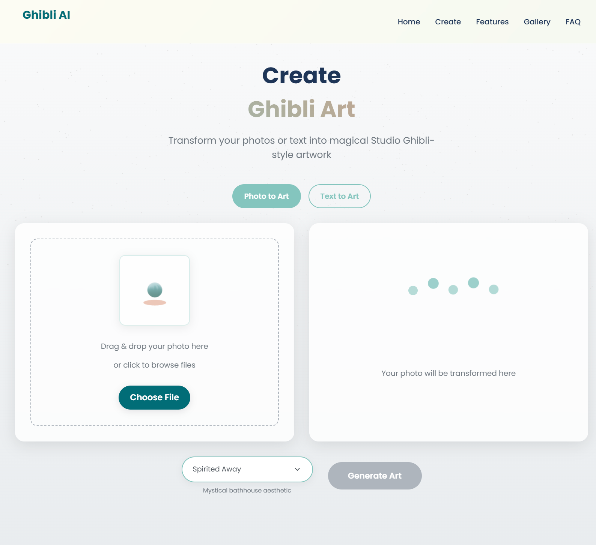
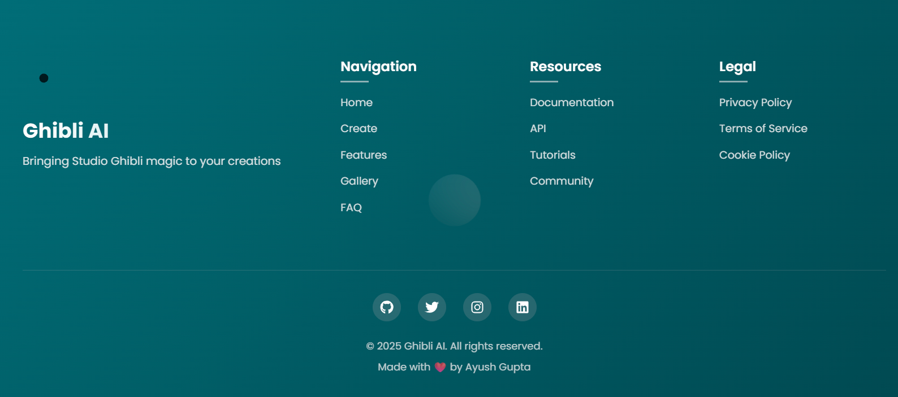

# 🎭 GhiblifyAI


**GhiblifyAI** is a full-stack AI web application that transforms user-uploaded images into **Studio Ghibli-inspired artwork** using the **Stability AI API**. The project combines a **React frontend** with a **Spring Boot backend** to provide a smooth and interactive image generation experience.

---

## ✨ Features

- 🖼️ Upload images for AI transformation
- 🎨 Generate Studio Ghibli-inspired artwork
- ⚡ Fast backend powered by Spring Boot
- 🌐 Clean and responsive React UI
- 🔗 Stability AI API integration

---

## 🛠️ Tech Stack

- **Frontend:** React
- **Backend:** Java, Spring Boot
- **AI Model:** Stability AI API
- **Build Tool:** Maven
- **Package Manager:** npm

---

## 📁 Project Structure

```text
GhiblifyAI/
├── backend/                 # Spring Boot REST API
│   ├── src/
│   ├── pom.xml
│   └── application.properties
│
├── frontend/                # React application
│   ├── public/
│   ├── src/
│   │   ├── assets/
│   │   ├── components/
│   │   └── App.js
│   └── package.json
│
├── Screenshot/              # Project preview images
├── LICENSE
└── README.md
```

---

## ⚙️ Getting Started

### Clone the repository

```bash
git clone https://github.com/dj-ayush/GhiblifyAI.git
cd GhiblifyAI
```

### Backend

```bash
cd backend
mvn clean install
mvn spring-boot:run
```

### Frontend

```bash
cd frontend
npm install
npm start
```

---

## 📸 Project Preview

### 🏠 Home Page

<p align="center">
  
</p>

### 🎨 Generated Artwork

<p align="center">
  
  
</p>

### 📱 Footer

<p align="center">
  
</p>

---

## 🤝 Contributing

Contributions are welcome!

1. Fork the repository
2. Create a new branch (`git checkout -b feature-name`)
3. Commit your changes (`git commit -m "Added feature"`)
4. Push to your branch (`git push origin feature-name`)
5. Open a Pull Request 🚀

---

## 📄 License

This project is licensed under the **MIT License**.

---

> Built with ❤️ by [@dj-ayush](https://github.com/dj-ayush)
