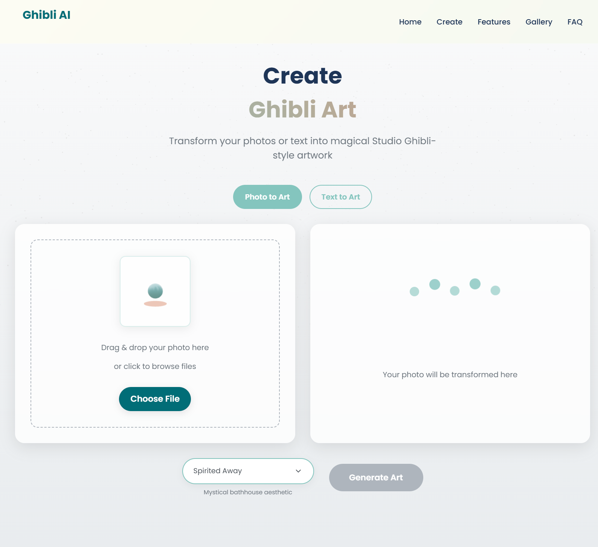

# 🎭 GhiblifyAI


**GhiblifyAI** is a web application that transforms user-uploaded images into **Studio Ghibli-style artworks** using the **Stability AI API**. The frontend is built with **React**, and the backend uses **Java with Spring Boot** to handle API requests, image processing, and integration with Stability AI.

---

## ✨ Features

- 🖼️ **Image Upload** – Upload any image for transformation.  
- 🎨 **Ghibli-Style Transformation** – Generates stylized artwork using Stability AI API.  
- 🌐 **Responsive Interface** – Clean, modern, and interactive frontend built with React.  
- ⚡ **Optimized Backend** – Java Spring Boot ensures fast and reliable API processing.

---

## 🛠️ Tech Stack

- **Frontend**: React  
- **Backend**: Java (Spring Boot)  
- **AI/Image Generation**: Stability AI API  
- **File Handling**: Multipart image upload in Spring Boot  

---

## 📁 Folder Structure
---
```
GhiblifyAI/
├── backend/
│   ├── src/
│   │   ├── main/
│   │   │   ├── java/com/ghiblifyai/
│   │   │   │   ├── controller/      # Handles API endpoints
│   │   │   │   └── service/         # Stability API calls
│   │   │   │
│   │   │   └── resources/
│   │   │       └── application.properties
│   └── pom.xml
├── frontend/
│   ├── public/
│   └── src/
│       ├── components/
│       ├── App.js
│       └── index.js
└── README.md


````
⚙️ Getting Started
---
### 1. Clone the repo
```
git clone https://github.com/dj-ayush/GhiblifyAI.git
cd GhiblifyAI
```

### 2. Backend Setup
```
cd backend
# Ensure Java 11+ and Maven are installed
# Configure your Stability API key in application.properties
# stability.api.key=YOUR_STABILITY_API_KEY
mvn clean install
mvn spring-boot:run
# Backend will be available at http://localhost:8080
```

### 3. Frontend Setup
```
cd frontend
npm install
npm start
# Frontend will run at http://localhost:3000
# It communicates with the backend API to generate Ghibli-style images
```
### 4. API Usage
```
Endpoint: /api/generate  
Method: POST  
Request Body (multipart/form-data):
{
  "file": "image_file",
  "style": "ghibli"
}
Response: Returns the transformed Ghibli-style image.
```
## 📸 Preview




---
## 🤝 Contributing

We welcome contributions!

1. Fork the repo
2. Create a new branch: `git checkout -b feature-name`
3. Commit your changes: `git commit -m "Added feature"`
4. Push to your branch: `git push origin feature-name`
5. Create a pull request 🚀

---

## 📄 License

This project is licensed under the [MIT License](LICENSE).

---

> Built with ❤️ by [@dj-ayush](https://github.com/dj-ayush)


